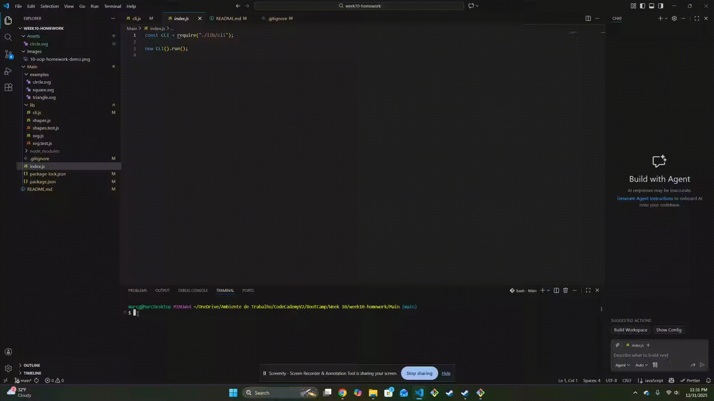

# SVG Logo Maker (Node.js CLI Exercise)

## Overview

This project is a **Node.js command-line exercise** designed to practice Object-Oriented Programming (OOP), CLI application design, and unit testing.  
The application prompts the user for input and generates a simple SVG logo based on the provided options.

---

## Learning Objectives

By completing this exercise, learners will:

- Practice **JavaScript classes and inheritance**
- Build a **command-line interface** using Inquirer
- Separate logic into reusable modules
- Generate valid **SVG files** programmatically
- Write and run **unit tests** with Jest
- Use Node.js filesystem utilities

---

## Features

- Interactive command-line interface
- Shape options:
  - Circle
  - Square
  - Triangle
- Customizable:
  - Text (1–3 characters)
  - Text color
  - Shape color
- Generates an SVG logo file
- Includes automated tests

---

## Project Structure
```
Main/
├── index.js # Application entry point
├── lib/
│ ├── cli.js # CLI prompt logic
│ ├── shapes.js # Shape classes (OOP)
│ ├── svg.js # SVG generation logic
│ ├── shapes.test.js # Unit tests for shapes
│ └── svg.test.js # Unit tests for SVG output
├── examples/ # Example output(s)
├── logo.svg # Sample generated logo
├── package.json
└── README.md
```

---

## Getting Started

### Prerequisites

- Node.js (v16+ recommended)
- npm

### Installation

```bash
git clone https://github.com/your-username/svg-logo-maker.git
cd svg-logo-maker
npm install
```

---

## Walkthrough Video

A walkthrough video is included to demonstrate the functionality of the application.

In the video, I show:

- Running the CLI application
- Answering the prompts to create a custom logo
- Generating an SVG logo file
- Running the Jest test suite and confirming all tests pass

This walkthrough verifies that the application works as expected and that the core logic is properly tested.

🎥 **Walkthrough Video:**  
